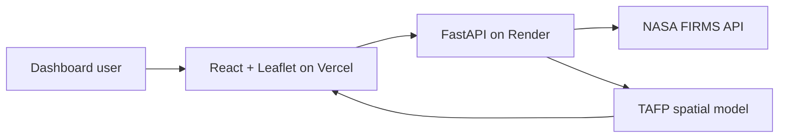

# TAFP Wildfire Intelligence

A responsive web map and scientific dashboard for running the TAFP fire-perimeter model against live [NASA FIRMS](https://firms.modaps.eosdis.nasa.gov/) near-real-time detections. Users choose a location and acquisition date, then see the exact selection, satellite detections, modeled perimeters, and summary metrics in either a light or dark theme.

## What is included

- Four automatic FIRMS feeds: `MODIS_NRT`, `VIIRS_NOAA20_NRT`, `VIIRS_NOAA21_NRT`, and `VIIRS_SNPP_NRT`
- Canada and USA location presets, including Alberta and other high-interest regions
- TAFP spatial processing in Python with DBSCAN, Delaunay geometry, alpha filtering, and sensor-specific outlier buffers
- Leaflet web map with interactive detections and modeled GeoJSON perimeters
- Scientific light and dark themes with responsive desktop/mobile layouts
- Secure server-side FIRMS key handling; the key is never sent to the browser or committed to GitHub
- One-click infrastructure definitions for Vercel and Render
- Automated frontend-build and Python-model checks in GitHub Actions

## Architecture



The frontend only calls the FastAPI service. Render stores `FIRMS_MAP_KEY` as a secret and uses it to retrieve a one-day CSV for the selected bounding box—never the full `world` feed.

## TAFP parameters

| Parameter | Value |
|---|---:|
| Projected CRS | `ESRI:102001` |
| DBSCAN radius (`eps`) | 1,500 m |
| Minimum samples | 3 |
| Alpha | 0.2 |
| Alpha scale factor | 5 |
| VIIRS outlier buffer | 375 m |
| MODIS outlier buffer | 1,000 m |

## Local development

Requirements: Node.js 22+ and Python 3.12+.

### 1. Start the API

```bash
cd backend
python -m venv .venv
source .venv/bin/activate
pip install -r requirements-dev.txt
cp .env.example .env
```

Edit `backend/.env` and add your FIRMS MAP_KEY, then run:

```bash
uvicorn app.main:app --reload --port 8000
```

API documentation is available at `http://localhost:8000/docs` and the health check at `http://localhost:8000/health`.

### 2. Start the dashboard

In a second terminal:

```bash
cd frontend
npm install
cp .env.example .env
npm run dev
```

Open `http://localhost:5173`.

## Deployment

### 1. Deploy the API on Render

[](https://render.com/deploy?repo=https://github.com/hanifbhuian/TAFP)

Render reads `render.yaml`. During setup, add:

- `FIRMS_MAP_KEY`: your private NASA FIRMS MAP_KEY
- `FRONTEND_ORIGINS`: initially `http://localhost:5173`; replace it with the final Vercel URL after step 2. Multiple origins can be comma-separated.

Copy the Render service URL, for example `https://tafp-api.onrender.com`.

### 2. Deploy the dashboard on Vercel

[](https://vercel.com/new/clone?repository-url=https://github.com/hanifbhuian/TAFP)

The root `vercel.json` contains the monorepo build settings. Add this project environment variable before deploying:

- `VITE_API_BASE_URL`: the Render service URL, with no trailing slash

After Vercel provides the production URL, update `FRONTEND_ORIGINS` in Render and redeploy the API. This completes browser CORS access.

> Never place `FIRMS_MAP_KEY` in a variable beginning with `VITE_`; Vite variables are public browser data.

## API routes

- `GET /health` — service and secret-configuration status
- `GET /api/locations` — supported Canada/USA location presets
- `GET /api/analyze?location_id=alberta&date=YYYY-MM-DD` — live FIRMS retrieval and TAFP result

The analysis response contains `selection`, `metrics`, individual `detections`, GeoJSON `perimeters`, model metadata, and source names.

## Scientific-use note

TAFP output is a modeled approximation built from satellite thermal anomalies. It is suitable for exploration and situational awareness, but it is not an official incident perimeter and should not be used as the sole basis for emergency decisions.

